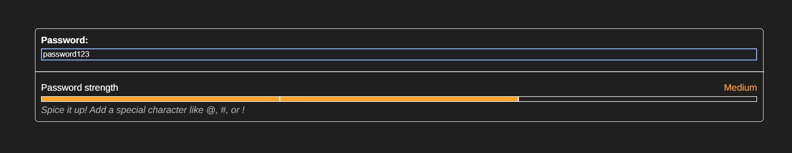

# Usense Test task



Test and evaluate password strength in real time.
This application visually displays the strength of passwords using color-coded sections.

## Quick start using Docker

Clone the repository and cd into

```terminal
  git clone https://github.com/TheTS-labs/usense_test_task.git
  cd usense_test_task
```

Build and run a Docker container

```terminal
  docker build -t usense_test_task:latest .
  docker run --rm -p 4000:4000 usense_test_task:latest
```

Now you can open the site at <http://localhost:4000/>

## Build and run without Docker

Requirements:

- Node.js v20+
- npm v10+
- git

Clone the repository and cd into:

```terminal
  git clone https://github.com/TheTS-labs/usense_test_task.git
  cd usense_test_task
```

Install Angular CLI and project dependencies:

```terminal
  npm install
  npm install -g @angular/cli
```

Build the project and run:

```terminal
  ng build --configuration=production
  npm run serve:ssr:usense_test_task
```

Now you can open the site at <http://localhost:4000/>
